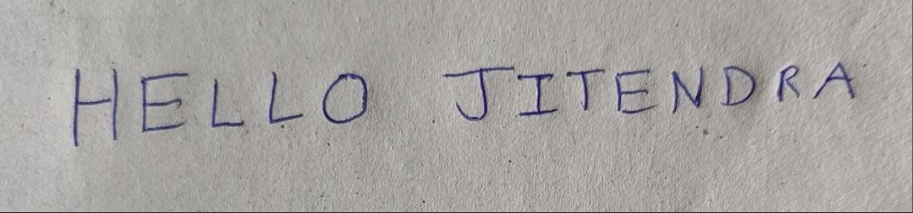

# Handwritten to OCR Text Converter

A JavaFX desktop application that converts images of handwritten or printed text into digital, editable text using Optical Character Recognition (OCR).

## Table of Contents
- [Features](#features)
- [Accuracy](#accuracy)
- [Demonstration](#demonstration)
- [How It Works](#how-it-works)
- [Tech Stack & Libraries](#tech-stack--libraries)
- [Prerequisites](#prerequisites)
- [Setup & Installation](#setup--installation)
- [How to Run](#how-to-run)
- [Project Structure](#project-structure)

## Features

* **Image Upload**: Easily select and upload image files (`.png`).
* **Image Preprocessing**: Automatically processes the image to improve OCR accuracy.
    * Grayscale Conversion
    * Binarization (Thresholding)
    * Noise Removal
* **Multi-Language Support**: Can recognize text in multiple languages (e.g., English, Hindi, Malyalam, more can be enabled with minimal change to a part of code).
* **User-Friendly Interface**: A simple and intuitive GUI built with JavaFX.
* **Real-time Output**: Displays the converted text directly in the application.

## Accuracy

This project uses a pre-trained Tesseract data model. The accuracy of the text detection is approximately:
* **80%** for clear, handwritten content.
* **85%** for digital images or screenshots of printed text.

Accuracy can vary depending on the quality of the source image and the complexity of the handwriting.

## Demonstration

The application is capable of taking a complex image with handwritten text and converting it into a digital format. Here is an example of the conversion flow.

### **Before Conversion**
This is the original input image containing handwritten notes.


### **After Conversion**
The application processes the image and outputs the recognized text, which is now digital and editable.


## How It Works

1.  **Input Image**: The user selects an image containing handwritten text.
2.  **Preprocessing**: The application uses the OpenCV library to clean up the image, making it easier for the OCR engine to read.
3.  **OCR Processing**: The preprocessed image is passed to the Tesseract OCR engine, which analyzes the image and extracts any recognizable text.
4.  **Display Output**: The extracted text is displayed in a text area, where the user can copy it for their use.

## Tech Stack & Libraries

* **Language**: [Java](https://www.java.com/) (Tested with JDK 21+)
* **Framework**: [JavaFX](https://openjfx.io/) for the Graphical User Interface (GUI).
* **Image Processing**: [OpenCV](https://opencv.org/) for preprocessing the images.
* **OCR Engine**: [Tesseract OCR](https://github.com/tesseract-ocr/tesseract) via the [Tess4J](http://tess4j.sourceforge.net/) Java wrapper.

## Prerequisites

Before you can run this project, you must have the following installed on your system:

1.  **Java Development Kit (JDK)**: Version 11 or higher.
2.  **Tesseract OCR Engine**: Must be installed on your system and its `tessdata` folder must be available. You can download it from the [Tesseract at UB Mannheim](https://github.com/UB-Mannheim/tesseract/wiki) page.
3.  **OpenCV**: The native libraries for your operating system must be installed. You can download it from the [OpenCV Releases](https://opencv.org/releases/) page.

## Setup & Installation

1.  **Clone the Repository**
    ```bash
    git clone [https://github.com/Abhinav2467/OCR-text-convertor.git](https://github.com/Abhinav2467/OCR-text-convertor.git)
    cd OCR-text-convertor
    ```

2.  **Configure Dependencies**
    This project relies on external libraries that are not included in the repository. You must configure your IDE (like Eclipse or IntelliJ) to include them.

    * **JavaFX SDK**: Download the SDK from [GluonHQ](https://gluonhq.com/products/javafx/) and add the JAR files from its `lib` folder to your project's build path.
    * **OpenCV JAR**: Download the OpenCV Java package and add the `opencv-xxx.jar` file to your project's build path.
    * **Tess4J JAR**: Download the Tess4J library and add the `tess4j.jar` file and its required dependencies (usually in a `lib` folder) to your project's build path.

3.  **Configure Native Libraries (VM Options)**
    Both JavaFX and OpenCV require native libraries. You must configure your IDE's run configuration to point to them.

    * **In Eclipse/IntelliJ, add the following VM options:**
        ```
        --module-path /path/to/your/javafx-sdk/lib --add-modules javafx.controls,javafx.fxml -Djava.library.path=/path/to/your/opencv/build/java/x64
        ```
        * Replace `/path/to/your/javafx-sdk/lib` with the absolute path to your JavaFX `lib` folder.
        * Replace `/path/to/your/opencv/build/java/x64` with the absolute path to your OpenCV native library folder (it might be `x64` or `x86` depending on your system).

## How to Run

1.  Open the project in your favorite Java IDE (e.g., Eclipse, IntelliJ IDEA).
2.  Ensure all the dependencies and VM options are configured correctly as described in the Setup section.
3.  Locate the `TextConverterFXApp.java` file.
4.  Right-click on the file and run it as a Java Application.

## Project Structure

```
HandwrittenTextOCRAT2/
├── .gitignore         # Tells Git which files to ignore
├── README.md          # This file
├── lib/               # (Recommended) Place external JARs here
├── src/
│   └── com/
│       └── ocrconverter/
│           ├── ImagePreprocessor.java
│           ├── OCRProcessor.java
│           ├── TextConverterFXApp.java    # Main application (GUI)
│           ├── TextConverterGUI.fxml
│           └── TextConverterGUIController.java
└── tessdata/          # Tesseract language files (e.g., eng.traineddata)
```
